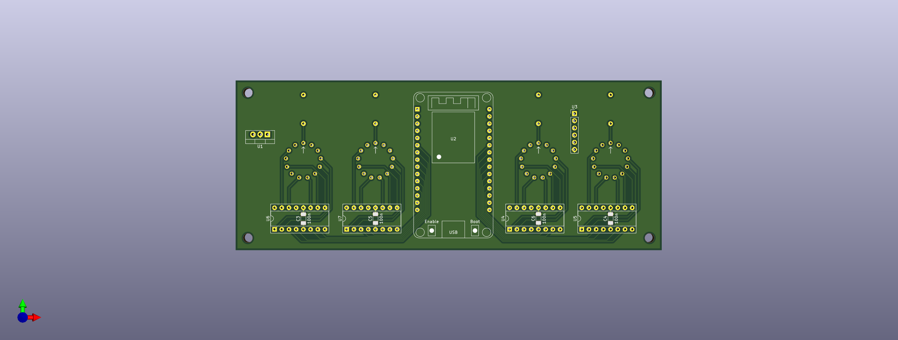
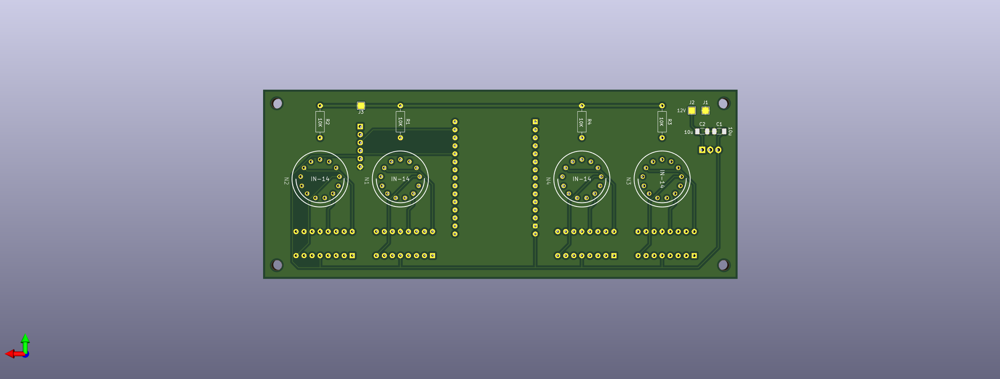

# nixie-clock-project
Project inspired by [GreatScott!](https://www.youtube.com/watch?v=ObgmVNV1Kfg)'s video. The main difference is in the MCU choice, in this project it is used the ESP32 to give the Nixie clock the change of time capabilities with bluetooth.

## PCB looks like
#### Front:

#### Back:

## List of components

The raw list
- 1 x ESP32 
- 4 x Nixie clock tube (IN-14 type)
- 4 x Nixie clock driver
- 1 x RTC (In the project it was used the DS 3231 shield)
- 1 x Boost converter (in order to get the 170V required by the nixie tubes)
- 1 x Voltage regulator (In the project it was used an L7805CV)
- 2 x 10uF capacitors (for the 12V and 5V lines)
- 4 x 100nF capacitors (one for each nixie driver)
- 4 x 10K Resistors (one between each nixie clock's anode and 170V)
Should be it.

## The firmware
The only piece that is required to fill is the `NIXIE_CLOCK_SERVICE_UUID` definition.
## Notes
1. In the current project the majority of components are in the same side of the Nixie tubes. This will prevent the use of a top flat cover, unless you decide to put a lot of holes in it.
So all the components should be moved on the back side and rearranging the connection in accordance.
2. The nixie clock tubes used for the hour and the one used for the minutes are not symmetrical to the center of the PCB.
